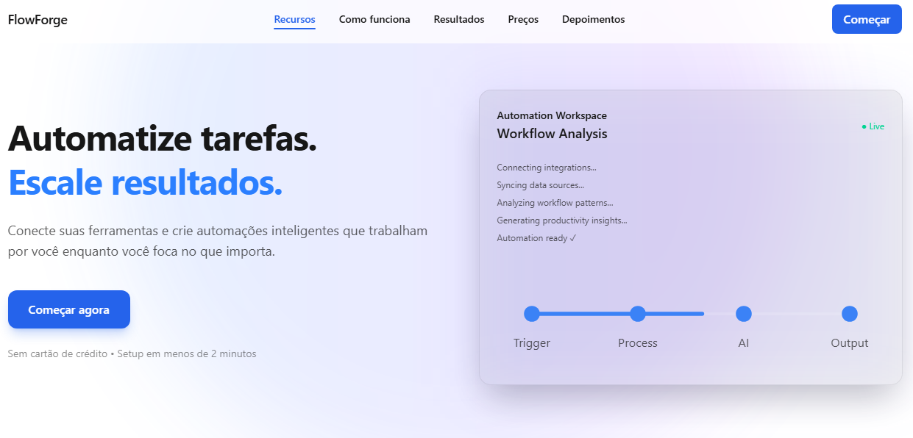
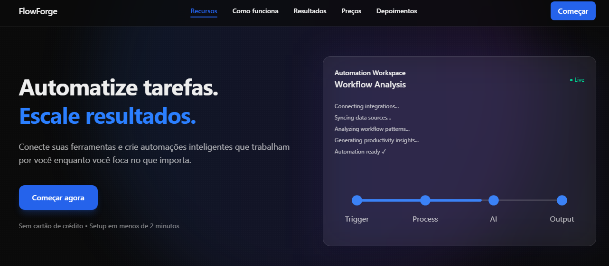
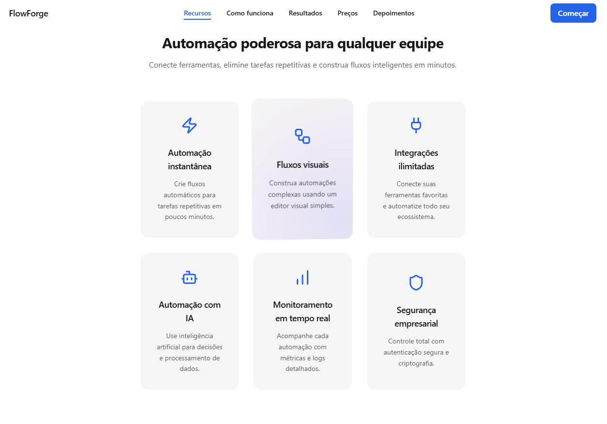

# 🚀 FlowForge — Landing Page SaaS Moderna

Landing page inspirada em produtos SaaS modernos, desenvolvida como estudo prático de arquitetura front-end e experiência de usuário.

O projeto simula decisões reais de produto, com foco em **estrutura escalável**, **consistência visual entre temas** e **interfaces performáticas**.

---

## 🌐 Preview

| Desktop | Dark Mode | features |
|---|---|---|
  |  | 

---

## 🧱 Stack Utilizada

- **Next.js (App Router)**
- **React + TypeScript**
- **Tailwind CSS**
- **Framer Motion**
- **SVG Animations**
- **Vercel (Deploy & CI)**

---

## ✨ Funcionalidades

- Landing page completa estilo SaaS
- Navegação suave entre seções
- Navbar fixa com efeito backdrop blur
- Dark Mode com Theme Switcher
- Layout totalmente responsivo
- Animações otimizadas para performance
- Charts animados em SVG
- Componentes reutilizáveis
- Deploy em ambiente real

---

## 🧠 Principais Aprendizados

### Técnicos
- Gerenciamento de tema global sem re-renders desnecessários
- Estruturação de componentes orientada à intenção
- Scroll navigation com layout fixo
- Implementação de animações progressivas
- Debugging e ajustes pós-deploy na Vercel

### Produto & Engenharia
- UI não termina quando “funciona”
- Iteração melhora significativamente a qualidade percebida
- Pensar como produto influencia decisões técnicas

---

## ⚙️ Executando Localmente

```bash
git clone https://github.com/seu-usuario/flowforge-landing.git
cd flowforge-landing
npm install
npm run dev
```

Acesse:

http://localhost:3000

---

## 🚀 Deploy

👉 https://flowforge-hazel.vercel.app

---

## 🧩 Engineering Notes

Pequenas decisões técnicas tomadas durante o desenvolvimento:

**Dark Mode como estado global**  
Evita múltiplas fontes de verdade e inconsistências visuais.

**Componentização por intenção**  
Componentes representam seções da experiência, não apenas blocos visuais.

**Animações progressivas**  
Implementadas após estabilizar o layout para reduzir retrabalho.

**Design adaptado por tema**  
Ajustes manuais garantem melhor hierarquia visual entre light e dark mode.

---

## 🔭 Próximos Passos

- Melhorias de acessibilidade (ARIA)
- Otimização Lighthouse / Core Web Vitals
- Testes básicos de componentes
- Integração com backend mockado

---

## 👨‍💻 Sobre Mim

Desenvolvedor Front-End em evolução contínua, focado em aprender através da construção de projetos próximos a cenários reais de produto.

Interesse especial em **UI Engineering**, performance e arquitetura front-end moderna.

🔗 LinkedIn:  
https://www.linkedin.com/in/matheus-araujo-bezerra/

---

## 📌 Observação

Projeto fictício criado para fins educacionais e prática de desenvolvimento front-end.